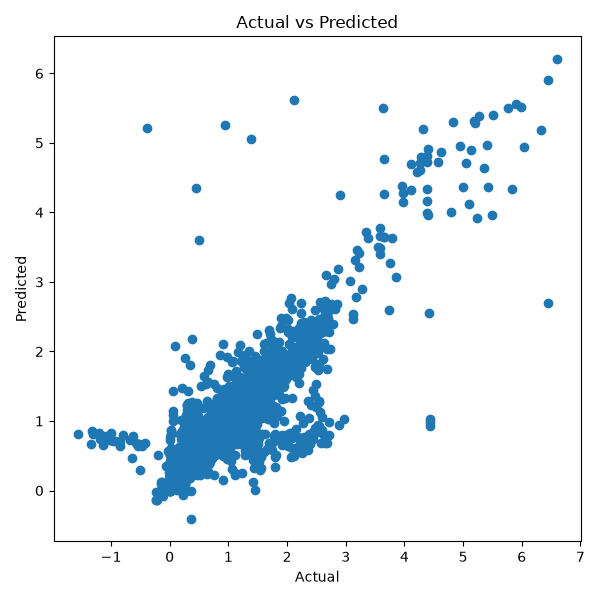
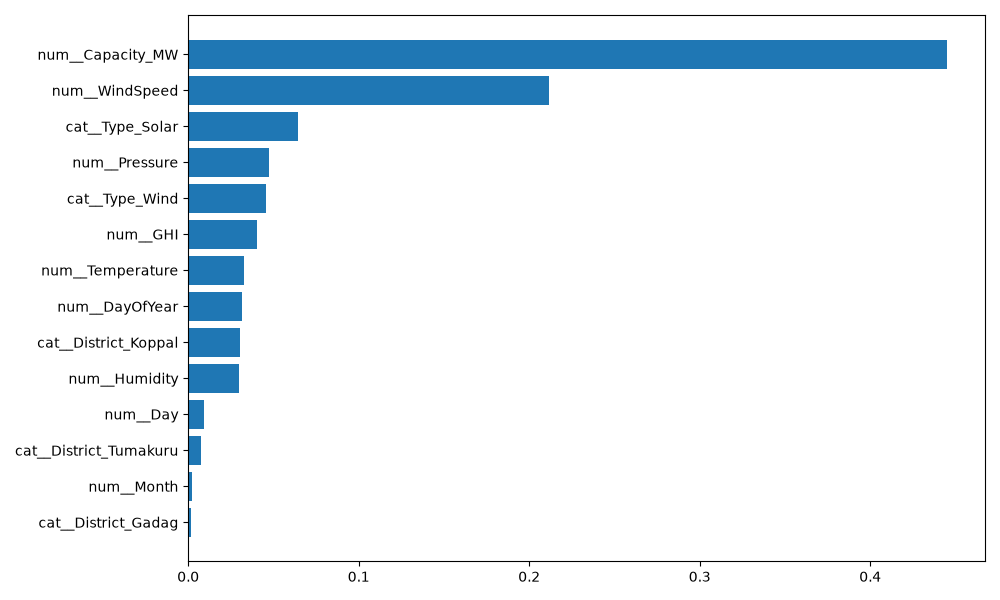
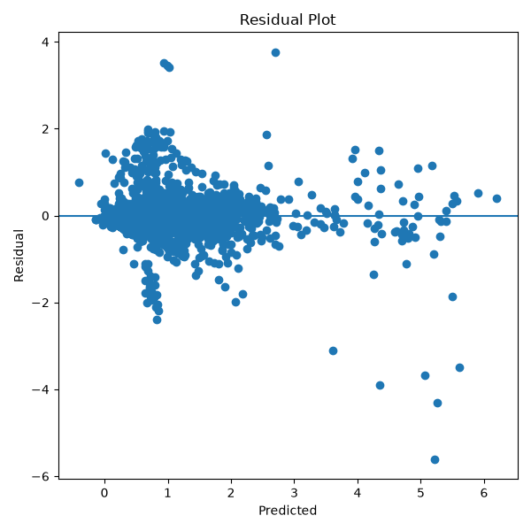

# 🌱 EnerVision

## AI-Based Renewable Energy Generation Forecasting for Karnataka

EnerVision is a machine learning project that predicts **plant-wise daily renewable energy generation** in Karnataka using historical weather observations and official renewable energy generation records.

The project integrates **NASA POWER weather data** with **Central Electricity Authority (CEA) plant-wise renewable energy generation reports** to build a high-quality machine learning dataset for renewable energy forecasting.

---

# 📌 Project Objectives

- Collect official renewable energy generation reports from CEA
- Collect historical weather data using the NASA POWER API
- Extract renewable plant metadata
- Geocode plant locations
- Clean and preprocess multiple datasets
- Merge weather and generation datasets
- Train and optimize a Random Forest regression model
- Evaluate model performance
- Generate prediction reports and visualizations

---

# 📂 Data Sources

## 1. Central Electricity Authority (CEA)

- Plant-wise Renewable Energy Generation Reports
- Karnataka Renewable Plant Metadata

## 2. NASA POWER API

Historical daily weather parameters:

- Temperature (°C)
- Relative Humidity (%)
- Wind Speed (m/s)
- Global Horizontal Irradiance (GHI)
- Surface Pressure (kPa)

---

# 📊 Final Dataset

| Property | Value |
|----------|------:|
| Duration | 30 Jun 2024 – Latest Available Reports |
| Records | 14,004 |
| Renewable Plants | 29 |
| Weather Features | 5 |
| Missing Values | 0 |
| Target Variable | DailyGeneration_MU |

---

# 🧠 Features Used

## Weather Features

- Temperature
- Humidity
- Wind Speed
- Global Horizontal Irradiance (GHI)
- Surface Pressure

## Plant Features

- Capacity (MW)
- Plant Type
- District

## Time Features

- Month
- Day
- Day of Year

---

# 🎯 Target Variable

**DailyGeneration_MU**

The target variable represents the **daily electricity generated (in Million Units)** by each renewable energy plant.

---

# 🤖 Machine Learning Model

- Random Forest Regressor
- GridSearchCV Hyperparameter Tuning
- Scikit-learn Pipeline
- One-Hot Encoding
- Feature Scaling

---

# 📈 Model Performance

| Metric | Value |
|---------|------:|
| MAE | 0.2627 |
| RMSE | 0.4729 |
| R² Score | 0.7244 |

## Best Hyperparameters

| Parameter | Value |
|-----------|------:|
| Number of Trees | 200 |
| Maximum Depth | 10 |

---

# ⚙️ Project Workflow

```text
CEA Plant Metadata
        │
        ▼
Plant Geocoding
        │
        ▼
NASA POWER API
        │
        ▼
Weather Dataset
        │
        ▼
CEA Daily Generation Reports
        │
        ▼
PDF Extraction
        │
        ▼
Data Cleaning & Parsing
        │
        ▼
Dataset Merge
        │
        ▼
Feature Engineering
        │
        ▼
Random Forest Training
        │
        ▼
Generation Prediction
```

---

# 📁 Project Structure

```text
EnerVision/
│
├── data/
│   ├── final/
│   │   └── final_training_dataset.csv
│   │
│   ├── generation/
│   │
│   ├── metadata/
│   │
│   └── weather/
│
├── models/
│   └── generation_random_forest.pkl
│
├── plots/
│   ├── generation_actual_vs_predicted.png
│   ├── generation_feature_importance.png
│   └── generation_residual_plot.png
│
├── reports/
│   ├── generation_metrics.csv
│   └── generation_feature_importance.csv
│
├── scripts/
│
├── README.md
│
└── requirements.txt
```

---

# 📊 Generated Outputs

- Final Training Dataset
- Trained Random Forest Model (.pkl)
- Feature Importance Report
- MAE, RMSE and R² Metrics
- Actual vs Predicted Plot
- Residual Plot

---

# 📷 Results

## Actual vs Predicted



---

## Feature Importance



---

## Residual Plot



---

# 🛠 Technologies Used

- Python
- Pandas
- NumPy
- Scikit-learn
- Matplotlib
- Joblib
- NASA POWER API
- Central Electricity Authority (CEA)

---

# 🚀 Future Improvements

- XGBoost Regression
- LightGBM Regression
- CatBoost Regression
- LSTM Time-Series Forecasting
- Real-Time Weather Integration
- Interactive Web Dashboard
- Live Renewable Energy Generation Prediction

---

# 👩‍💻 Developed By

**EnerVision Project Team**

**Phase-II Major Project**