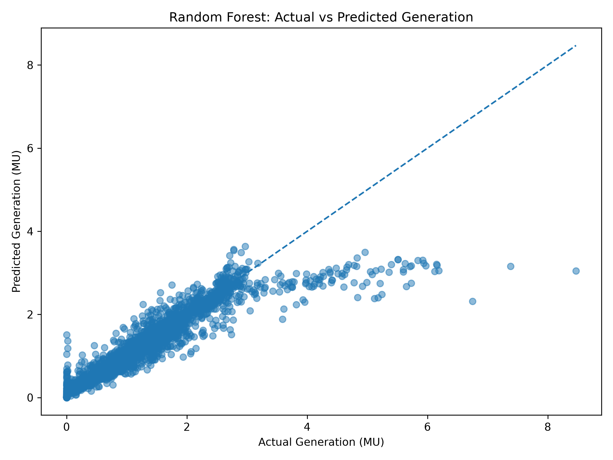
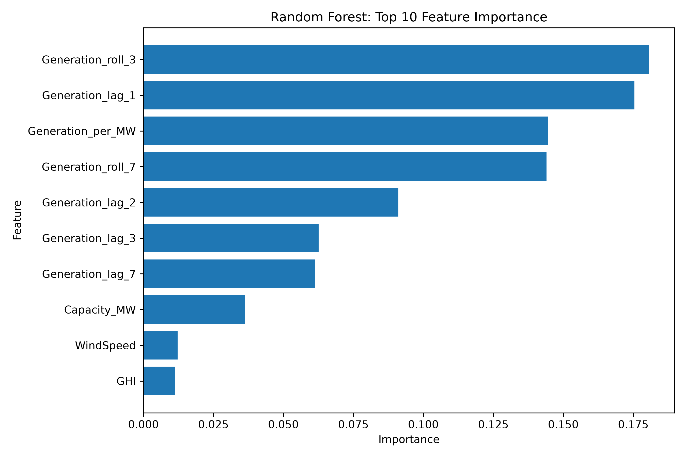
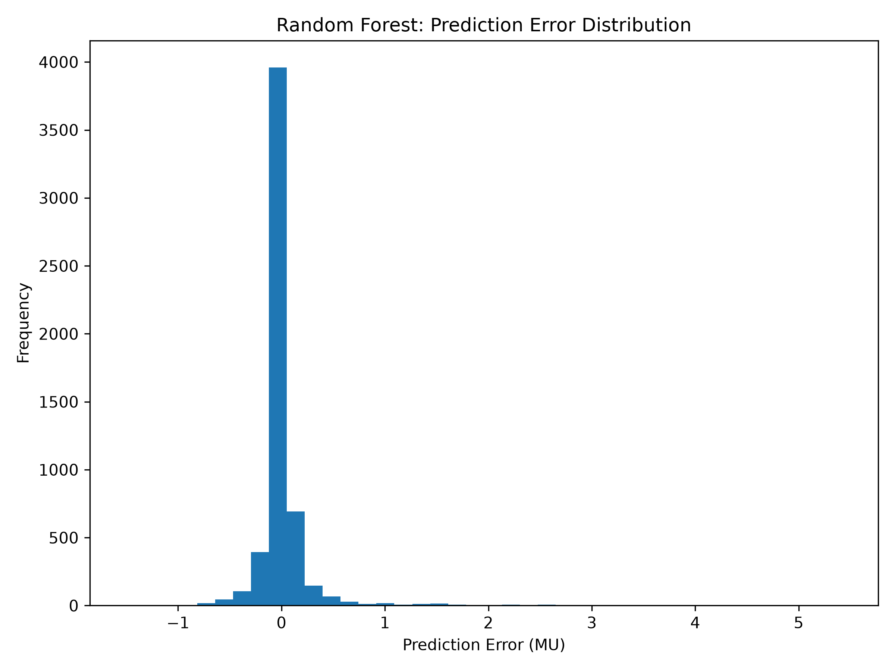

# 🌱 EnerVision

## AI-Based Renewable Energy Generation Forecasting for Karnataka

EnerVision is a machine learning project for forecasting **plant-wise daily renewable energy generation** in Karnataka using historical renewable energy generation records and weather observations.

The project integrates **Central Electricity Authority (CEA) plant-wise renewable energy generation data** with **NASA POWER historical weather data** to construct a plant-weather dataset and train a Random Forest regression model.

---

## 📌 Project Objectives

- Collect renewable energy generation records from CEA
- Collect historical weather observations using the NASA POWER API
- Extract and process renewable energy plant information
- Identify plant locations and associated Karnataka districts
- Clean and preprocess generation and weather datasets
- Combine generation and weather observations
- Engineer temporal, lag, rolling and normalized generation features
- Train a Random Forest regression model
- Evaluate prediction performance using MAE, RMSE and R²
- Generate prediction results, feature importance reports and visualizations

---

## 📂 Data Sources

### 1. Central Electricity Authority (CEA)

Plant-wise renewable energy generation records were used as the primary generation source.

The generation dataset contains information including:

- Plant name
- Renewable energy type
- Installed capacity (MW)
- Daily generation (MU)
- District
- Commission information
- Other plant metadata

### 2. NASA POWER API

Historical daily weather observations were used as explanatory variables.

Weather parameters include:

- Temperature (°C)
- Relative Humidity (%)
- Wind Speed (m/s)
- Global Horizontal Irradiance (GHI)
- Atmospheric Pressure

---

## 📊 Dataset

The complete generation-weather dataset contains:

| Property | Value |
|----------|------:|
| Generation records | 29,369 |
| Renewable plants | 37 |
| Generation period | 28 May 2020 – 05 August 2026 |
| Weather period | 01 January 2018 – 06 August 2026 |
| Weather variables | 5 |
| Missing weather values in merged dataset | 0 |
| Target variable | DailyGeneration_MU |

The complete merged dataset is stored as:

`data/final/full_generation_weather_dataset.csv`

---

## 🧠 Feature Engineering

The final Random Forest model uses **25 input features**.

### Weather Features

- Temperature
- Humidity
- WindSpeed
- GHI
- Pressure

### Lagged Weather Features

- Temperature_lag_1
- Humidity_lag_1
- WindSpeed_lag_1
- GHI_lag_1

These represent the previous day's weather conditions.

### Generation History Features

- Generation_lag_1
- Generation_lag_2
- Generation_lag_3
- Generation_lag_7
- Generation_roll_3
- Generation_roll_7

These features capture recent generation behaviour.

### Normalized Generation Feature

- Generation_per_MW

This represents generation normalized by installed plant capacity.

### Temporal Features

- Year
- Month
- DayOfYear
- DayOfWeek
- Month_sin
- Month_cos
- DayOfYear_sin
- DayOfYear_cos

Cyclic encoding is used for month and day-of-year to represent seasonal patterns.

---

## 🎯 Target Variable

### DailyGeneration_MU

`DailyGeneration_MU` represents the **daily electricity generated by a renewable energy plant in Million Units (MU)**.

The Random Forest model predicts this value for the test observations.

---

## 🤖 Machine Learning Model

### Random Forest Regression

The final model used in this phase is:

**RandomForestRegressor**

### Configuration

| Parameter | Value |
|-----------|------:|
| Number of Trees | 300 |
| Random State | 42 |
| Number of CPU Jobs | -1 |
| Max Features | sqrt |

The model is trained using the engineered plant-weather feature dataset.

No GridSearchCV, feature scaling or one-hot encoding is used in the current Random Forest implementation.

---

## 📚 Training and Testing Dataset

The final engineered dataset contains observations from **25 plants common to both the training and testing partitions**.

| Property | Value |
|----------|------:|
| Feature dataset rows | 22,764 |
| Training rows | 17,193 |
| Testing rows | 5,571 |
| Plants | 25 |
| Input features | 25 |
| Target | DailyGeneration_MU |

The datasets are stored as:

- `data/final/plant_train.csv`
- `data/final/plant_test.csv`
- `data/final/plant_features_dataset.csv`

---

## 📈 Random Forest Performance

The current Random Forest model achieved:

| Metric | Value |
|---------|------:|
| MAE | 0.111638 |
| RMSE | 0.300339 |
| R² | 0.871158 |

### Interpretation

The model achieved an **R² of approximately 0.871**, indicating that the model explains a substantial proportion of the variation in daily plant-level renewable energy generation within the test dataset.

---

## 🔝 Top Feature Importance

The most influential features in the current Random Forest model are:

| Rank | Feature | Importance |
|-----:|---------|-----------:|
| 1 | Generation_roll_3 | 0.180712 |
| 2 | Generation_lag_1 | 0.175407 |
| 3 | Generation_per_MW | 0.144640 |
| 4 | Generation_roll_7 | 0.144009 |
| 5 | Generation_lag_2 | 0.091050 |
| 6 | Generation_lag_3 | 0.062540 |
| 7 | Generation_lag_7 | 0.061322 |
| 8 | Capacity_MW | 0.036229 |
| 9 | WindSpeed | 0.012179 |
| 10 | GHI | 0.011228 |

The results indicate that **recent generation history and normalized generation behaviour are particularly important predictors** for the current model.

---

## ⚙️ Project Workflow

```text
CEA Generation Data
        │
        ▼
Generation Extraction
        │
        ▼
Generation Cleaning & Parsing
        │
        ▼
Plant Metadata Processing
        │
        ▼
Plant-District Mapping
        │
        ▼
NASA POWER Weather Data
        │
        ▼
Weather Cleaning
        │
        ▼
Generation + Weather Merge
        │
        ▼
Feature Engineering
        │
        ▼
Train / Test Dataset
        │
        ▼
Random Forest Regression
        │
        ▼
Model Evaluation
        │
        ├── MAE
        ├── RMSE
        └── R²
        │
        ▼
Predictions & Visualizations
```

---

## 📁 Project Structure

```text
EnerVision/
│
├── data/
│   ├── final/
│   │   ├── full_generation_weather_dataset.csv
│   │   ├── plant_features_dataset.csv
│   │   ├── plant_train.csv
│   │   └── plant_test.csv
│   │
│   ├── generation/
│   │   ├── generation_final.csv
│   │   ├── historical_generation.csv
│   │   ├── historical_generation_clean.csv
│   │   └── isgs_plants.csv
│   │
│   ├── metadata/
│   │   ├── generation_plant_mapping.csv
│   │   ├── plants.csv
│   │   ├── plants_geocoded.csv
│   │   └── plant_weather_mapping.csv
│   │
│   ├── results/
│   │   ├── random_forest_predictions.csv
│   │   ├── random_forest_plant_performance.csv
│   │   └── random_forest_feature_importance.csv
│   │
│   └── weather/
│       ├── weather_clean.csv
│       └── weather_raw.csv
│
├── models/
│   └── random_forest_model.pkl
│
├── plots/
│   ├── random_forest_actual_vs_predicted.png
│   ├── random_forest_feature_importance.png
│   └── random_forest_prediction_error_distribution.png
│
├── reports/
│   ├── data_dictionary.md
│   ├── generation_metrics.csv
│   └── generation_feature_importance.csv
│
├── scripts/
│   └── train_random_forest.py
│
├── README.md
│
└── requirements.txt
```

---

## 📊 Generated Outputs

The Random Forest training script automatically generates or updates the following outputs.

### Model

`models/random_forest_model.pkl`

### Prediction Results

`data/results/random_forest_predictions.csv`

### Plant-wise Performance

`data/results/random_forest_plant_performance.csv`

### Feature Importance

- `data/results/random_forest_feature_importance.csv`
- `reports/generation_feature_importance.csv`

### Evaluation Metrics

`reports/generation_metrics.csv`

### Visualizations

- `plots/random_forest_actual_vs_predicted.png`
- `plots/random_forest_feature_importance.png`
- `plots/random_forest_prediction_error_distribution.png`

These outputs are refreshed whenever the Random Forest training script is executed.

---

## 📷 Results

### Actual vs Predicted



### Feature Importance



### Prediction Error Distribution



---

## 🛠 Technologies Used

- Python
- Pandas
- NumPy
- Scikit-learn
- Matplotlib
- Pickle
- NASA POWER API
- Central Electricity Authority (CEA)

---

## 🚀 Future Improvements

- Gradient Boosting Regression
- XGBoost Regression
- LightGBM Regression
- CatBoost Regression
- LSTM-based time-series forecasting
- Improved plant-level geographic mapping
- Real-time weather integration
- Short-term renewable energy forecasting
- Interactive renewable energy dashboard
- Kannada language support
- Confidence-aware energy predictions

---

## ▶️ Running the Random Forest Model

Activate the virtual environment and execute:

```powershell
python scripts	rain_random_forest.py
```

The script trains the Random Forest model and automatically updates:

- Model file
- Predictions
- Plant-wise performance
- Feature importance
- Evaluation metrics
- Three visualization plots

---

## 👩‍💻 Developed By

**EnerVision Project Team**

**Phase-II Major Project**
